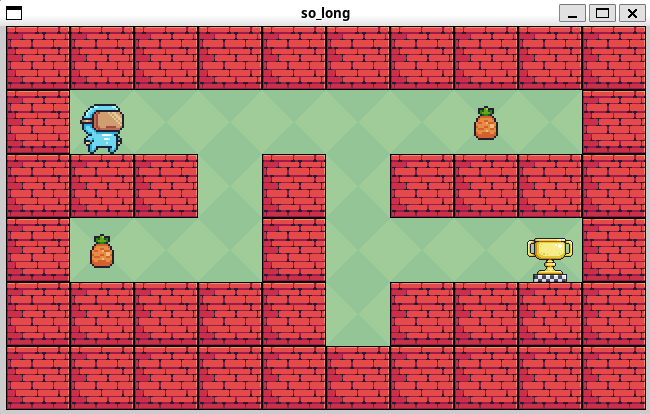

## so-long

[Click here for subject file](./docs/en.subject.pdf)  
A fun and simple 2D game made from scratch using the [`minilibx`](https://github.com/42Paris/minilibx-linux) library.

#### How to play

Use `W` `A` `S` `D` to move the player.  
Collect all the *pineapples* and reach the goal to win.

#### Setting up

1. Run `make run` to compile and run the game with `maps/maze.ber`.

2. Run `make run MAP=maps/map.ber`, with `map.ber` being the map file you want to use.

#### Some takeaways 🌱

1. Of course it be learning about the game loop, collision detection, and rendering.

2. Handling the textures were fun too, cause it required `.xpm` files and some parsing.

   > Run `textures/convert.py` to convert PNG in `textures/` to XPM.
